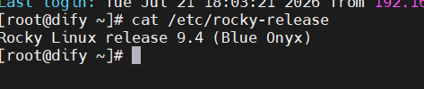

# Dify 企业级 AI 应用平台部署 SOP

文档版本：V1.0

记录人：刁荣松

核心项目：Dify AI 应用平台本地化与云原生部署

部署目标：完成 Dify 平台从单机 Docker Compose 到 K8s 集群的标准化落地，实现服务高可用、镜像统一管理、数据持久化与外部稳定访问，解决系统兼容、镜像拉取、存储挂载、网络配置等工程问题，形成可直接复用的企业级部署方案

部署环境：RockyLinux 9 x86_64 / Kubernetes 集群 / Helm 3

------

## 1. 部署架构与环境规划

### 1.1 部署方案说明

本次部署提供两套标准化方案，覆盖测试验证与生产运行全场景：

- **方案一：Docker Compose 单机部署**：适用于测试验证、小型场景，快速搭建可用的 Dify 平台，部署成本低、运维简单
- **方案二：K8s + Helm 生产集群部署**：适用于企业生产环境，实现高可用、弹性伸缩、数据持久化的生产级部署，支持多节点容灾

### 1.2 技术栈清单

| 技术 / 组件    | 版本要求       | 核心用途                               |
| :------------- | :------------- | :------------------------------------- |
| RockyLinux     | 9.x            | 操作系统，支撑容器与 K8s 运行基础环境  |
| Docker         | 24.0+          | 容器运行时，统一服务部署环境           |
| Docker Compose | v2.x           | 单机多容器编排，快速部署全套 Dify 组件 |
| Kubernetes     | 1.24+          | 容器编排引擎，生产级集群调度与管理     |
| Helm           | 3.x            | K8s 包管理工具，一键部署 Dify 全套服务 |
| Harbor         | 2.x            | 私有镜像仓库，统一管理 Dify 业务镜像   |
| PostgreSQL     | 13+            | 关系型数据库，存储平台核心业务数据     |
| Redis          | 6.x            | 缓存服务，提升平台响应速度             |
| Nginx          | 1.20+          | 反向代理，实现域名访问与流量转发       |
| PV/PVC         | -              | K8s 持久化存储方案，保障容器数据不丢失 |
| Dify           | v1.16.0 稳定版 | 企业级 AI 应用开发平台核心服务         |

### 1.3 硬件配置建议

| 部署方案           | CPU         | 内存      | 系统盘      | 数据盘      |
| :----------------- | :---------- | :-------- | :---------- | :---------- |
| 单机部署           | 4 核        | 8G        | 100G        | 200G        |
| K8s 集群（3 节点） | 每节点 4 核 | 每节点 8G | 每节点 100G | 每节点 200G |

------

## 2. 前置环境初始化（所有节点必做）

### 2.1 操作系统选型与替换

**问题背景**：初始环境为 CentOS 7，因系统内核与依赖库版本过低，无法支持 Docker Compose v2、高版本容器运行时，导致 Dify 官方部署流程无法执行。

**解决方案**：经全面评估后，直接将 CentOS 7 系统替换为 RockyLinux 9，彻底解决系统兼容性问题，满足 Docker、容器编排与 K8s 运行的基础环境要求。

**系统版本验证**：

```shell
# 执行以下命令，输出 Rocky Linux release 9.x 即为正常
cat /etc/rocky-release
```



### 2.2 基础依赖包安装

```shell
dnf install -y wget vim net-tools gcc gcc-c++ make git curl jq
```

!(images\image-20260721180739882.png)

### 2.3 Docker 与 Docker Compose v2 安装

#### 2.3.1 修复系统基础源与配置国内 Docker 镜像源

RockyLinux 9 初始源可能存在加载失败问题，先替换为国内源再配置 Docker 源：

```shell
# 1. 备份并替换 Rocky 9 系统源为阿里云镜像
mkdir -p /etc/yum.repos.d/bak
mv /etc/yum.repos.d/Rocky-*.repo /etc/yum.repos.d/bak/
curl -o /etc/yum.repos.d/Rocky-BaseOS.repo https://mirrors.aliyun.com/repo/Rocky-9-BaseOS.repo
curl -o /etc/yum.repos.d/Rocky-AppStream.repo https://mirrors.aliyun.com/repo/Rocky-9-AppStream.repo
curl -o /etc/yum.repos.d/Rocky-Extras.repo https://mirrors.aliyun.com/repo/Rocky-9-Extras.repo
dnf clean all && dnf makecache

# 2. 安装源管理工具
dnf install -y yum-utils device-mapper-persistent-data lvm2

# 3. 添加阿里云 Docker CE 镜像源，修正版本变量适配 Rocky 9
yum-config-manager --add-repo https://mirrors.aliyun.com/docker-ce/linux/centos/docker-ce.repo
sed -i 's/$releasever/9/g' /etc/yum.repos.d/docker-ce.repo
```

#### 2.3.2 安装 Docker 与 Docker Compose v2

```
dnf install -y docker-ce docker-ce-cli containerd.io docker-compose-plugin
```

#### 2.3.3 配置镜像加速与启动服务

```shell
# 1. 创建 Docker 配置目录，配置国内镜像加速（以华为云 SWR 加速为例）
mkdir -p /etc/docker
cat > /etc/docker/daemon.json << EOF
{
  "registry-mirrors": [
    "https://382d8a78866945cdafcd976ca3fb55bd.mirror.swr.myhuaweicloud.com",
    "https://hub-mirror.c.163.com",
    "https://mirror.baidubce.com"
  ],
  "log-driver": "json-file",
  "log-opts": {
    "max-size": "100m",
    "max-file": "3"
  },
  "mtu": 1400
}
EOF

# 2. 启动服务并设置开机自启
systemctl daemon-reload
systemctl start docker
systemctl enable docker
```


#### 2.3.4 安装验证

```
docker --version
docker compose version
```

两条命令均正常输出版本信息即为安装成功。


### 2.4 系统基础配置

```
# 关闭防火墙（生产环境可按需开放端口）
systemctl stop firewalld
systemctl disable firewalld

# 关闭SELinux
setenforce 0
sed -i 's/SELINUX=enforcing/SELINUX=disabled/g' /etc/selinux/config

# 时间同步与时区设置
timedatectl set-timezone Asia/Shanghai

# 配置公共 DNS，避免域名解析失败
echo -e "nameserver 223.5.5.5\nnameserver 223.6.6.6\nnameserver 114.114.114.114" > /etc/resolv.conf
```

------

## 3. 方案一：Docker Compose 单机部署

### 3.1 目录规划

创建工作目录与持久化数据目录，实现数据与程序分离：

```shell
mkdir -p /opt/dify
mkdir -p /data/dify-persist/{postgres,redis,models,uploads}
# 开放目录权限，避免容器内读写报错
chmod -R 777 /data/dify-persist
```


### 3.2 获取 Dify 部署源码

国内环境直接访问 GitHub 存在网络限制，采用加速代理方式获取：

```
# 方案A：加速克隆指定稳定版本（推荐）
git clone --branch v1.16.0 https://ghproxy.com/https://github.com/langgenius/dify.git /opt/dify

# 方案B：离线下载源码包（Git不可用时使用）
cd /opt
wget https://ghproxy.com/https://github.com/langgenius/dify/archive/refs/tags/v1.16.0.tar.gz -O dify.tar.gz
tar -zxvf dify.tar.gz
mv dify-1.16.0 dify

# 进入部署目录
cd /opt/dify/docker
```

### 3.3 环境变量配置

复制环境变量模板并修改核心配置：

```shell
cp .env.example .env
vim .env
```

**核心配置项说明（必填）**：

1. 安全密钥与密码配置

   ```shell
   # PostgreSQL 数据库配置
   POSTGRES_USER=postgres
   POSTGRES_PASSWORD=自定义强密码（仅字母数字，避免#!等特殊符号）
   POSTGRES_DB=dify
   
   # Redis 缓存配置
   REDIS_PASSWORD=自定义Redis密码
   
   # 应用加密密钥（32位随机字符串，执行 openssl rand -hex 16 生成）
   SECRET_KEY=生成的32位随机字符串
   ```

2. 平台访问地址配置（90% 前端报错的根源）

   必须与浏览器实际访问地址完全一致，IP、端口、http/https 严格匹配：

   持久化存储适配

   容器内路径保持默认，需同步修改 

   ```shell
   docker-compose.yaml
   ```

    中的 volumes 挂载规则，将数据映射到 

   ```shell
   /data/dify-persist
   ```

    对应目录。

### 3.4 启动全套服务

```shell
# 后台启动所有服务
docker compose up -d
```

部署组件包含：后端 API、前端页面、Worker 异步服务、Websocket 服务、向量数据库 Weaviate、PostgreSQL、Redis、Nginx 反向代理、代码沙箱、插件服务。


### 3.5 服务状态验证

```shell
# 查看所有容器状态
docker compose ps
```

- 所有服务状态显示 `Up`、数据库 / Redis 显示 `healthy` 即为启动成功
- `api` 服务需等待数据库迁移完成后变为 `healthy`，首次启动约 1-3 分钟
- 若 `nginx` 出现 `Restarting`、`api` 显示 `unhealthy`，参考第 6 章故障排查


**补充验证命令**：

```
# 查看指定服务日志（以api为例）
docker compose logs api --tail 50

# 本地验证接口连通性
curl -I http://127.0.0.1/console/api/version
```

### 3.6 Nginx 反向代理与域名配置

1. Dify 内置 Nginx 容器统一对外暴露 80/443 端口，自动代理前端页面与后端 API，无需额外部署宿主机 Nginx
2. 若需绑定域名，直接修改 `.env` 中访问地址为域名，同时配置域名解析到服务器 IP
3. 云服务器环境需在安全组放行 80 端口入方向规则
4. 容器默认随 Docker 服务自启动，服务器重启后自动恢复

**访问入口**：浏览器访问 `http://服务器IP`，首次访问自动跳转至初始化页面，按指引设置管理员账号与大模型配置。


------

## 4. 方案二：K8s + Helm 生产集群部署

### 4.1 前置准备

#### 4.1.1 K8s 集群状态验证

在 Master 节点执行以下命令，确认集群状态正常：

```shell
# 验证节点状态
kubectl get nodes
# 验证核心组件状态
kubectl get pods -n kube-system
```

所有节点状态为 `Ready`、核心组件正常运行即可继续。


#### 4.1.2 Harbor 私有仓库准备

1. 确保 Harbor 私有仓库服务正常，创建 `dify` 项目用于存储平台镜像
2. 所有 K8s 节点均可正常访问 Harbor 仓库地址
3. 提前在集群中创建镜像拉取 Secret，参考 4.2.3 小节

### 4.2 镜像预处理（解决官方镜像拉取失败）

**问题背景**：官方镜像均托管于 Docker Hub，境外地址在国内集群环境易出现拉取超时、连接拒绝、TLS 握手失败等问题。

**解决方案**：将所有镜像同步至内网 Harbor 私有仓库，部署时直接从内网拉取，彻底规避外网波动。

#### 4.2.1 Dify v1.16.0 完整镜像清单

| 组件            | 官方镜像地址                        | 版本        |
| :-------------- | :---------------------------------- | :---------- |
| 后端 API        | langgenius/dify-api                 | 1.16.0      |
| 前端 Web        | langgenius/dify-web                 | 1.16.0      |
| Agent 后端      | langgenius/dify-agent-backend       | 1.16.0      |
| 代码沙箱        | langgenius/dify-sandbox             | 0.2.15      |
| 本地 Agent 沙箱 | langgenius/dify-agent-local-sandbox | 1.16.0      |
| 插件守护进程    | langgenius/dify-plugin-daemon       | 0.6.3-local |
| PostgreSQL      | postgres                            | 15-alpine   |
| Redis           | redis                               | 6-alpine    |
| 向量库 Weaviate | semitechnologies/weaviate           | 1.27.0      |
| Nginx           | nginx                               | 1.27.0      |
| SSRF 代理       | ubuntu/squid                        | latest      |

#### 4.2.2 镜像拉取、打标与推送

在有外网的运维机器上执行：

```shell
# 1. 定义变量
DIFY_VERSION=1.16.0
HARBOR_ADDR=harbor.yourcompany.com/dify  # 替换为实际Harbor地址

# 2. 批量拉取官方镜像
docker pull langgenius/dify-api:${DIFY_VERSION}
docker pull langgenius/dify-web:${DIFY_VERSION}
docker pull langgenius/dify-agent-backend:${DIFY_VERSION}
docker pull langgenius/dify-sandbox:0.2.15
docker pull langgenius/dify-agent-local-sandbox:${DIFY_VERSION}
docker pull langgenius/dify-plugin-daemon:0.6.3-local
docker pull postgres:15-alpine
docker pull redis:6-alpine
docker pull semitechnologies/weaviate:1.27.0
docker pull nginx:1.27.0
docker pull ubuntu/squid:latest

# 3. 批量打标签
docker tag langgenius/dify-api:${DIFY_VERSION} ${HARBOR_ADDR}/dify-api:${DIFY_VERSION}
docker tag langgenius/dify-web:${DIFY_VERSION} ${HARBOR_ADDR}/dify-web:${DIFY_VERSION}
docker tag langgenius/dify-agent-backend:${DIFY_VERSION} ${HARBOR_ADDR}/dify-agent-backend:${DIFY_VERSION}
docker tag langgenius/dify-sandbox:0.2.15 ${HARBOR_ADDR}/dify-sandbox:0.2.15
docker tag langgenius/dify-agent-local-sandbox:${DIFY_VERSION} ${HARBOR_ADDR}/dify-agent-local-sandbox:${DIFY_VERSION}
docker tag langgenius/dify-plugin-daemon:0.6.3-local ${HARBOR_ADDR}/dify-plugin-daemon:0.6.3-local
docker tag postgres:15-alpine ${HARBOR_ADDR}/postgres:15-alpine
docker tag redis:6-alpine ${HARBOR_ADDR}/redis:6-alpine
docker tag semitechnologies/weaviate:1.27.0 ${HARBOR_ADDR}/weaviate:1.27.0
docker tag nginx:1.27.0 ${HARBOR_ADDR}/nginx:1.27.0
docker tag ubuntu/squid:latest ${HARBOR_ADDR}/ubuntu-squid:latest

# 4. 登录Harbor并批量推送
docker login ${HARBOR_ADDR} -u 管理员账号 -p 密码
docker push ${HARBOR_ADDR}/dify-api:${DIFY_VERSION}
docker push ${HARBOR_ADDR}/dify-web:${DIFY_VERSION}
# 依次推送所有打标后的镜像
```


#### 4.2.3 K8s 集群创建镜像拉取密钥

```shell
# 创建业务命名空间
kubectl create namespace dify

# 创建镜像拉取Secret
kubectl create secret docker-registry harbor-pull-secret \
  --docker-server=harbor.yourcompany.com \
  --docker-username=拉取账号 \
  --docker-password=密码 \
  -n dify
```

### 4.3 PV/PVC 持久化存储配置

#### 4.3.1 存储规划

针对 Dify 四类核心数据创建持久化存储，避免容器销毁导致数据丢失：

| 数据类型     | 对应组件   | 建议容量 | 容器内挂载路径           |
| :----------- | :--------- | :------- | :----------------------- |
| 数据库数据   | PostgreSQL | 20Gi     | /var/lib/postgresql/data |
| 缓存持久化   | Redis      | 5Gi      | /data                    |
| 向量库数据   | Weaviate   | 50Gi     | /var/lib/weaviate        |
| 用户上传文件 | API 服务   | 50Gi     | /app/api/storage         |

#### 4.3.2 存储配置方案

**场景 A：集群存在 StorageClass 动态存储（推荐，云厂商集群通用）**

无需手动创建 PV，通过 PVC 自动绑定存储资源，在 values 配置中指定存储类名称与容量即可。

```shell
# 先查询集群可用存储类
kubectl get storageclass
```

记录存储类名称，后续写入 values 配置。

**场景 B：自建集群无存储类，静态 PV 方案**

1. 在存储节点创建数据目录并开放权限：

   ```shell
   mkdir -p /data/dify-k8s/{postgres,redis,weaviate,uploads}
   chmod -R 777 /data/dify-k8s
   ```

2. 编写 

   ```shell
   dify-pv.yaml
   ```

    资源清单：

   ```shell
   apiVersion: v1
   kind: PersistentVolume
   metadata:
     name: dify-postgres-pv
   spec:
     capacity:
       storage: 20Gi
     accessModes:
       - ReadWriteOnce
     persistentVolumeReclaimPolicy: Retain
     storageClassName: manual
     hostPath:
       path: /data/dify-k8s/postgres
   ---
   apiVersion: v1
   kind: PersistentVolume
   metadata:
     name: dify-redis-pv
   spec:
     capacity:
       storage: 5Gi
     accessModes:
       - ReadWriteOnce
     persistentVolumeReclaimPolicy: Retain
     storageClassName: manual
     hostPath:
       path: /data/dify-k8s/redis
   ---
   apiVersion: v1
   kind: PersistentVolume
   metadata:
     name: dify-weaviate-pv
   spec:
     capacity:
       storage: 50Gi
     accessModes:
       - ReadWriteOnce
     persistentVolumeReclaimPolicy: Retain
     storageClassName: manual
     hostPath:
       path: /data/dify-k8s/weaviate
   ---
   apiVersion: v1
   kind: PersistentVolume
   metadata:
     name: dify-uploads-pv
   spec:
     capacity:
       storage: 50Gi
     accessModes:
       - ReadWriteOnce
     persistentVolumeReclaimPolicy: Retain
     storageClassName: manual
     hostPath:
       path: /data/dify-k8s/uploads
   ```

3. 创建 PV 资源：

   ```
   kubectl apply -f dify-pv.yaml
   ```

**验证 PVC 状态**：部署完成后执行

```
kubectl get pvc -n dify
```

所有 PVC 状态为 `Bound` 即为配置成功。


------

### 4.4 外置独立中间件 StatefulSet 部署（Postgres/Redis/Weaviate）

> 已移除报错字段 imagePullOptions，依靠 docker 全局 tls 关闭 + harbor-auth 密钥拉取镜像

#### 4.4.1 external-pg.yaml

```
apiVersion: apps/v1
kind: StatefulSet
metadata:
  name: external-postgres
  namespace: dify
spec:
  replicas: 1
  selector:
    matchLabels:
      app: external-postgres
  serviceName: external-postgres-svc
  template:
    metadata:
      labels:
        app: external-postgres
    spec:
      imagePullSecrets:
      - name: harbor-auth
      containers:
      - name: postgres
        image: harbor:443/dify/postgres:15-alpine
        env:
        - name: POSTGRES_USER
          value: dify
        - name: POSTGRES_PASSWORD
          value: Dify@2026PG#987
        - name: POSTGRES_DB
          value: dify
        ports:
        - containerPort: 5432
        volumeMounts:
        - name: pg-data
          mountPath: /var/lib/postgresql/data
      volumes:
      - name: pg-data
        persistentVolumeClaim:
          claimName: dify-postgres-pvc
---
apiVersion: v1
kind: Service
metadata:
  name: external-postgres-svc
  namespace: dify
spec:
  selector:
    app: external-postgres
  ports:
  - port: 5432
    targetPort: 5432
  clusterIP: None
```

#### 4.4.2 external-redis.yaml

```
apiVersion: apps/v1
kind: StatefulSet
metadata:
  name: external-redis
  namespace: dify
spec:
  replicas: 1
  selector:
    matchLabels:
      app: external-redis
  serviceName: external-redis-svc
  template:
    metadata:
      labels:
        app: external-redis
    spec:
      imagePullSecrets:
      - name: harbor-auth
      containers:
      - name: redis
        image: harbor:443/dify/redis:6-alpine
        command: ["redis-server"]
        args: ["--requirepass", "Redis@Dify123!"]
        ports:
        - containerPort: 6379
        volumeMounts:
        - name: redis-data
          mountPath: /data
      volumes:
      - name: redis-data
        persistentVolumeClaim:
          claimName: dify-redis-pvc
---
apiVersion: v1
kind: Service
metadata:
  name: external-redis-svc
  namespace: dify
spec:
  selector:
    app: external-redis
  ports:
  - port: 6379
    targetPort: 6379
  clusterIP: None
```

#### 4.4.3 external-weaviate.yaml

```
apiVersion: apps/v1
kind: StatefulSet
metadata:
  name: external-weaviate
  namespace: dify
spec:
  replicas: 1
  selector:
    matchLabels:
      app: external-weaviate
  serviceName: external-weaviate-svc
  template:
    metadata:
      labels:
        app: external-weaviate
    spec:
      imagePullSecrets:
      - name: harbor-auth
      containers:
      - name: weaviate
        image: harbor:443/dify/weaviate:1.27.0
        env:
        - name: AUTHENTICATION_APIKEY_ENABLED
          value: "true"
        - name: AUTHENTICATION_APIKEY_ALLOWED_KEYS
          value: "WVF5YThaHlkYwhGUSmCRgsX3tD5ngdN8pkih"
        - name: AUTHENTICATION_APIKEY_USERS
          value: hello@dify.ai
        ports:
        - containerPort: 8080
        - containerPort: 50051
        volumeMounts:
        - name: weaviate-data
          mountPath: /var/lib/weaviate
      volumes:
      - name: weaviate-data
        persistentVolumeClaim:
          claimName: dify-weaviate-pvc
---
apiVersion: v1
kind: Service
metadata:
  name: external-weaviate-svc
  namespace: dify
spec:
  selector:
    app: external-weaviate
  ports:
  - name: http
    port: 8080
    targetPort: 8080
  - name: grpc
    port: 50051
    targetPort: 50051
  clusterIP: None
```

#### 4.4.4 部署中间件并等待全部 Running

```
kubectl apply -f external-pg.yaml
kubectl apply -f external-redis.yaml
kubectl apply -f external-weaviate.yaml
# 实时观察pod状态，三个中间件全部Running再执行helm部署
kubectl get pods -n dify -w
```


### 4.5 Helm4.5 离线部署 Dify 主业务（关闭内置中间件，对接外置服务）

> 重要说明：官方在线 Helm 仓库 charts.dify.ai 国内 DNS 无法解析，全程离线 Chart 本地部署，适配 Helm4.5 语法。

#### 4.5.1 获取离线 Chart 源码（ghproxy 加速）

```
mkdir -p /opt/dify-helm && cd /opt/dify-helm
wget https://ghproxy.com/https://github.com/langgenius/dify/archive/refs/tags/v1.16.0.tar.gz
tar -zxvf v1.16.0.tar.gz
cd dify-1.16.0/charts/dify
```

#### 4.5.2 values-custom.yaml 自定义配置（适配外置中间件 + 内网 Harbor）

```shell
# ========== 全局镜像仓库与拉取密钥 ==========
global:
  imageRegistry: "harbor:443/dify"
  imagePullSecrets:
    - name: harbor-auth

# ========== 前端Web组件 ==========
web:
  image:
    repository: dify-web
    tag: 1.16.0
  env:
    SITE_URL: "http://dify.local"
    CONSOLE_WEB_URL: "http://dify.local"
  resources:
    limits:
      cpu: 1000m
      memory: 1Gi
    requests:
      cpu: 200m
      memory: 256Mi

# ========== API后端（对接外置Postgres/Redis/Weaviate） ==========
api:
  image:
    repository: dify-api
    tag: 1.16.0
  resources:
    limits:
      cpu: 2000m
      memory: 2Gi
    requests:
      cpu: 500m
      memory: 512Mi
  env:
    SECRET_KEY: "Dify@Local2026SecretKey32BitXX"
    SITE_API_URL: "http://dify.local/api"
    CONSOLE_API_URL: "http://dify.local/api"
    # 外置Postgres集群内服务地址
    DB_HOST: external-postgres-svc.dify.svc.cluster.local
    DB_PORT: 5432
    DB_USER: dify
    DB_PASSWORD: Dify@2026PG#987
    DB_NAME: dify
    # 外置Redis
    REDIS_HOST: external-redis-svc.dify.svc.cluster.local
    REDIS_PORT: 6379
    REDIS_PASSWORD: Redis@Dify123!
    # 外置Weaviate向量库
    WEAVIATE_URL: http://external-weaviate-svc.dify.svc.cluster.local:8080
    WEAVIATE_API_KEY: WVF5YThaHlkYwhGUSmCRgsX3tD5ngdN8pkih
  livenessProbe:
    initialDelaySeconds: 60
    periodSeconds: 30
    timeoutSeconds: 10
    failureThreshold: 3
  readinessProbe:
    initialDelaySeconds: 30
    periodSeconds: 10
    timeoutSeconds: 5
    failureThreshold: 3
  # 用户上传文件持久化，绑定已有PVC
  persistence:
    enabled: true
    storageClass: "manual"
    size: 50Gi
    existingClaim: dify-uploads-pvc

# ========== 异步任务Worker ==========
worker:
  image:
    repository: dify-api
    tag: 1.16.0
  resources:
    limits:
      cpu: 2000m
      memory: 2Gi
    requests:
      cpu: 500m
      memory: 512Mi

# ========== 关闭Chart内置全部中间件（已独立部署） ==========
postgresql:
  enabled: false
redis:
  enabled: false
weaviate:
  enabled: false
```

#### 4.5.3 Helm4.5 安装部署命令

```shell
# 本地Chart安装，Helm4.5标准语法
helm install dify . -n dify -f values-custom.yaml
# 验证部署状态
helm list -n dify
# STATUS=deployed 代表安装成功，等待业务pod启动
kubectl get pods -n dify -w
```


### 4.6 Ingress 域名访问配置 dify-ingress.yaml

```shell
apiVersion: networking.k8s.io/v1
kind: Ingress
metadata:
  name: dify-ingress
  namespace: dify
  annotations:
    kubernetes.io/ingress.class: "nginx"
    nginx.ingress.kubernetes.io/proxy-body-size: "100m"
    nginx.ingress.kubernetes.io/proxy-read-timeout: "300"
    nginx.ingress.kubernetes.io/proxy-connect-timeout: "60"
spec:
  rules:
    - host: dify.local
      http:
        paths:
          - path: /
            pathType: Prefix
            backend:
              service:
                name: dify-web
                port:
                  number: 3000
          - path: /api
            pathType: Prefix
            backend:
              service:
                name: dify-api
                port:
                  number: 5001
```

#### 4.6.1 生效与验证

```shell
kubectl apply -f dify-ingress.yaml
kubectl get ingress -n dify
```

1. ADDRESS 列显示 nginx-ingress 控制器 IP 即为正常
2. 本地 hosts 添加 `IngressIP  dify.local`
3. 浏览器访问 [http://dify.local](https://link.wtturl.cn/?target=http%3A%2F%2Fdify.local&scene=im&aid=582478&lang=zh) 进入初始化页面

## 5. 部署验证与功能验收

### 5.1 服务状态验证

```shell
# 查看所有 Pod 运行状态
kubectl get pods -n dify
# 查看服务暴露情况
kubectl get svc -n dify
```

所有 Pod 状态为 `Running`、就绪数 1/1 即为部署成功；若出现 `ImagePullBackOff`、`CrashLoopBackOff` 参考第 6 章排查。

### 5.2 核心功能全量验证

依次验证平台核心能力，确保功能完整可用：

1. **平台初始化验证**：访问页面完成管理员账号创建，正常进入控制台
2. **知识库能力验证**：创建知识库，上传 PDF/Word 文档，验证文档解析与向量检索正常
3. **插件能力验证**：安装内置插件，验证插件调用与工具执行正常
4. **工作流验证**：创建简单工作流，调试运行，确认节点执行与数据流转正常
5. **对话应用验证**：创建对话应用，绑定大模型与知识库，验证问答响应与知识库引用正常
6. **API 接口验证**：调用应用 API 密钥，验证外部系统对接能力


### 5.3 持久化有效性验证

1. 删除运行中的 Dify 业务 Pod：

   ```
   kubectl delete pod -l app.kubernetes.io/name=api -n dify
   ```

2. 等待集群自动重建 Pod，验证业务数据、配置信息、知识库文件未丢失

3. 登录控制台确认历史数据完整，持久化方案生效

------

## 6. 常见故障排查手册

| 故障现象                                                 | 根因分析                                                     | 解决方案                                                     |
| :------------------------------------------------------- | :----------------------------------------------------------- | :----------------------------------------------------------- |
| Docker Compose v2 安装运行失败                           | CentOS 7 内核与依赖库版本过低，不支持 v2 版本                | 将系统替换为 RockyLinux 9，使用高版本内核与适配依赖          |
| Nginx 容器循环重启，日志报 `envsubst: command not found` | 加速源拉取的 `nginx:latest` 为第三方国密裁剪版，缺少基础工具 | 强制指定官方标准镜像 `nginx:1.27.0`，重建容器；避免使用未知第三方镜像 |
| API 容器状态 `unhealthy`，健康检查失败                   | 1. 服务初始化阻塞（Redis / 数据库配置错误）2. 存储目录权限不足3. SECRET_KEY 配置非法 | 1. 核对 `.env` 中数据库、Redis 地址密码2. 开放持久化目录权限 `chmod -R 777`3. 重新生成 32 位 SECRET_KEY4. 查看 api 日志定位具体报错 |
| 前端页面提示「渲染此组件时发生了意外错误」               | 1. 后端 API 未就绪2. `.env` 中 API 地址配置与实际访问地址不匹配 | 1. 等待 api 服务变为 healthy2. 修正 `SITE_API_URL`、`CONSOLE_API_URL` 为实际访问地址，重启服务 |
| 镜像拉取失败（连接拒绝 / TLS 握手超时）                  | 官方镜像源为境外地址，国内网络访问受限                       | 1. 配置国内镜像加速源2. 生产环境同步镜像至内网 Harbor，配置内网地址 |
| Helm 仓库添加失败，提示 `charts.dify.ai` 域名不存在      | 官方 Helm 仓库域名国内 DNS 解析失败，全网 NXDOMAIN           | 放弃在线仓库，下载官方源码包使用本地 Chart 离线部署          |
| PV/PVC 一直处于 Pending 状态                             | 1. 存储类名称不匹配2. PV 容量小于 PVC 申请容量3. 无可用 PV 资源 | 1. 核对 StorageClass 名称拼写2. 调整 PV 容量大于等于 PVC 申请值3. 手动创建对应规格的静态 PV |
| 容器挂载目录报 `permission denied`                       | 宿主机目录权限不足，容器内用户无读写权限                     | 1. 宿主机执行 `chmod -R 777 数据目录`2. 配置初始化容器启动时修改目录权限 |
| 服务器能访问，外网无法打开页面                           | 1. 云平台安全组未放行对应端口2. 防火墙未关闭3. Ingress 配置错误 | 1. 云控制台安全组放行 80/443 端口入方向2. 关闭系统防火墙或放行对应端口3. 核对 Ingress 规则与服务名称、端口 |
| 数据库迁移成功但 API 无响应                              | gunicorn 进程启动后初始化阻塞，多为向量库 Weaviate 连接异常  | 1. 检查 weaviate 容器状态与日志2. 核对 `.env` 中 WEAVIATE_URL 配置 |
| `git clone` GitHub 仓库连接拒绝                          | 国内网络直连 GitHub 443 端口受限                             | 使用 ghproxy 加速代理地址克隆，或下载离线 tar 包             |
